# Black-Litterman Model: Multi-Strategy Portfolio Construction

This project demonstrates the use of the Black-Litterman model to incorporate and combine multiple (long only) strategies into a single portfolio.

This Black-Litterman portfolio achieved a consistent risk-adjusted return, with a Sharpe ratio of 0.96 in-sample and 2.04 out-sample. It outperformed most of the individual strategies in terms of Sharpe ratio in both periods, demonstrated the model's strength in extracting insights from and incorporating individual strategies, allow it to perform well even when the effectiveness of individual factor fluctuates.

- **Trading universe:** S&P 500 constituents
- **Data period:** 2018 to 2024, with the train-test split set at 2023-01-01
- **Portfolio type:** Long-only, monthly rebalancing

**Final Results:**  
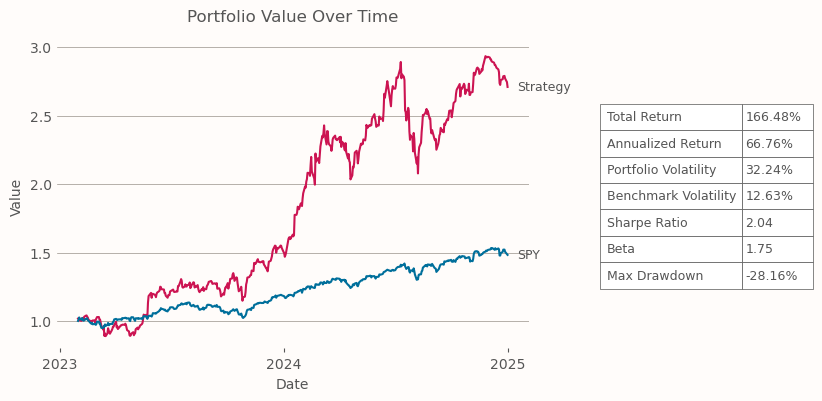

**Project Structure:**  
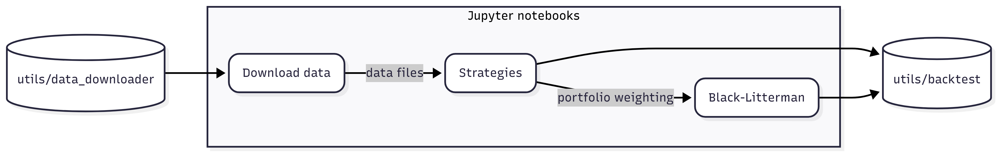


## Table of Contents

- [Data Collection](#data-collection)
- [Strategies](#strategies)
  - [Momentum](#momentum)
  - [Short-term Reversal](#short-term-reversal)
  - [Short Interest](#short-interest)
  - [ARIMA-GARCH](#arima-garch)
- [Black-Litterman Model](#black-litterman-model)
- [In-sample Results](#in-sample-results)
- [Out-sample Results](#out-sample-results)

## Data Collection

Data is collected from various sources. The process is managed by utility classes in `utils/data_downloader.py`, and downloaded data are saved as CSV files in the `data/` directory. The process is executed by running `Download data.ipynb`.

- **Price & Volume:** Downloaded from Yahoo Finance using the yfinance Python package.
- **Short Interest:** Downloaded from the FINRA API.
- **Market Capitalization:** Downloaded from the Financial Modeling Prep API.
- **Risk-Free Rate:** 3-Month Treasury Bill rate, downloaded manually from the Federal Reserve (https://fred.stlouisfed.org/series/DTB3)

> **Note:**
> To download the data yourself, you will need to modify the config file and replace the placeholders with your own API keys.

## Strategies

Firstly, we read the dataset from the saved CSV file, shifting all the datasets by one period to avoid any look-ahead bias:
```python
# Data preprocessing
price_df = pd.read_csv('data/price.csv', index_col='Date', parse_dates=True).shift(1)
volume_df = pd.read_csv('data/volume.csv', index_col='Date', parse_dates=True).shift(1)
short_interest_df = pd.read_csv('data/short_interest.csv', index_col='Date', parse_dates=True, dtype=float).shift(1)
benchmark_df = pd.read_csv('data/benchmark.csv', index_col='Date', parse_dates=True).shift(1)
```

Then we implement our strategies. To reduce transaction costs (set as 0.1%), strategies are designed to rebalance monthly. Four individual strategies were implemented, each based on distinct financial factors, and the related parameters were fine-tuned according to their performance in the training period. The portfolio weightings are saved to be used later in the Black-Litterman model.

- ### Momentum

  Allocates to stocks with strong recent performance and high trading volume
  
  Calculate a combined momentum value by adding up short (T-1 month), medium (T-6 to T-1 month), and long-term (T-12 to T-1 month) price momentum
  ```python
  short_momentum = price_df.pct_change(periods=21, fill_method=None)
  medium_momentum = price_df.pct_change(periods=105, fill_method=None).shift(periods=21)
  long_momentum = price_df.pct_change(periods=231, fill_method=None).shift(periods=21)
  weight_df = (short_momentum.loc[long_momentum.index] + medium_momentum.loc[long_momentum.index] + long_momentum)
  ```

  Select the top 20% of stocks with the highest combined momentum, and filters this group for the top 20% by trading volume, then assign equal weights to the eligible stocks
  
  ```python
  for date in weight_df.index:
      vol = volume_df.loc[date]
      upper_vol = vol[vol >= vol.quantile(0.8)]

      r = weight_df.loc[date, upper_vol.index]
      upper_r_symbols = r[r >= r.quantile(0.8)].index

      weight_df.loc[date, :] = 0
      weight_df.loc[date, upper_r_symbols] = 1

  # Normalize the weights, adjust for monthly rebalancing
  weight_df = weight_df.div(weight_df.sum(axis=1), axis=0).dropna(how='all')
  weight_df = weight_df.groupby(pd.Grouper(freq='ME')).tail(1)
  ```
  

- ### Short-term Reversal

  Allocates to assets with weak recent returns combined with a high drop in recent trading volume, betting on reversion
  
  The returns and change in trading volume are first calculated on a monthly basis
  ```python
  return_df = price_df.groupby(pd.Grouper(freq='ME')).tail(1).pct_change(fill_method=None).dropna(how="all")
  volume_change_df = volume_df.groupby(pd.Grouper(freq='ME')).mean().pct_change(fill_method=None).dropna(how="all")
  volume_change_df.index = return_df.index
  weight_df = return_df.copy()
  ```

  Filter for the bottom 10% of stocks in terms of trading volume, and further filters for the bottom 10% by return, then assign equal weights to the selected stocks
  ```python
  for date in weight_df.index:
      vol = volume_change_df.loc[date]
      bottom_vol = vol[vol <= vol.quantile(0.1)]

      r = return_df.loc[date, bottom_vol.index]
      bottom_r_symbols = r[r <= r.quantile(0.1)].index
          
      weight_df.loc[date, :] = 0
      weight_df.loc[date, bottom_r_symbols] = 1

  # Normalize the weights
  weight_df = weight_df.div(weight_df.sum(axis=1), axis=0).dropna(how='all')
  ```
  
- ### Short Interest

  Go long on stocks with the lowest days to cover (short interest ÷ average trading volume). The hypothesis is that a stock being lightly shorted relative to the market is a good indicator for outperformance

  Calculate the days to cover for each stock
  ```python
  weight_df = short_interest_df.copy()
  period_ends = weight_df.index
  period_starts = pd.Index([volume_df.index[0]]).append(weight_df.index[:-1] + pd.Timedelta(days=1))

  for start_date, end_date in zip(period_starts, period_ends):
      weight_df.loc[end_date] = weight_df.loc[end_date].div(volume_df.loc[start_date:end_date].mean())
  ```

  We then assign equal weights to the stocks with the lowest 5% days to cover
  ```python
  lower = weight_df.apply(lambda x: x.quantile(0.05), axis=1)
  weight_df = pd.DataFrame(np.where(weight_df.lt(lower, axis=0), 1, 0), 
                          index=weight_df.index,  
                          columns=weight_df.columns)

  # Normalize the weights
  weight_df = weight_df.div(weight_df.sum(axis=1), axis=0).dropna(how="all")
  ```

- ### ARIMA-GARCH

  Use the ARIMA-GARCH model to predict future return and volatility, and assign positive weights to the stocks with high predicted return and low predicted volatility. Since the model fitting process is time consuming, PCA are used to identify 20 stocks that best represents the whole market for each rebalancing period, and the ARIMA-GARCH model is only fitted for those stocks.

  Firstly, conduct PCA to obtain the list of representative stocks, and fit ARIMA-GARCH on those stocks
  ```python
  return_df = price_df.pct_change(fill_method=None)
  arima_results, garch_results = [], []
  month_end = return_df.iloc[500:].groupby(pd.Grouper(freq='ME')).tail(1).index
  for date in month_end:
      current_index = return_df.index.get_loc(date)

      # conduct PCA to reduce dimensionality
      r = return_df.iloc[current_index-500:current_index]
      cov = r.cov()

      cov_eigval, cov_eigvec = np.linalg.eig(cov)
      idx = cov_eigval.argsort()[::-1]
      cov_eigval = cov_eigval[idx]    
      cov_eigvec = cov_eigvec[:, idx]

      pc_stock = []
      for i in range(20):     
          mask = np.ones(len(cov), dtype=bool)
          mask[pc_stock] = False
          pc_stock.append(np.argmax(np.abs(cov_eigvec[i])[mask]))

      # Fit ARIMA-GARCH models
      data = [r[col].dropna().values if i in pc_stock else pd.DataFrame() for i, col in enumerate(return_df.columns)]
      
      arima_res = [pmdarima.auto_arima(df) if len(df) > 0 else None for df in data]
      arima_results.append(arima_res)

      garch_models = [arch_model(res.resid(), vol='Garch', p=1, q=1, lags=1) if res != None else None for res in arima_res]
      garch_res = [model.fit(disp="off") if model is not None else None for model in garch_models]
      garch_results.append(garch_res)
  ```


  Use the fitted ARIMA-GARCH model to generate prediction for the mean and variance of future returns
  ```python
  mean_forecast = []
  var_forecast = []
  for arima, garch in zip(arima_results, garch_results):
      mean_forecast.append([np.mean(res.predict(n_periods=21)) if res != None else np.nan for res in arima])
      var_forecast.append([np.mean(res.forecast(horizon=21).variance) if res != None else np.nan for res in garch])

  mean_df = pd.DataFrame(mean_forecast, index=month_end, columns=return_df.columns)
  variance_df = pd.DataFrame(var_forecast, index=month_end, columns=return_df.columns)
  ```

  Calculate the ratio for mean and variance, ignoring stocks with negative ratio, and assign weights to the remaining stocks with positive ratio
  ```python
  weight_df = mean_df.div(variance_df)
  weight_df = weight_df.clip(lower=0).fillna(0)
  weight_df = weight_df.div(weight_df.sum(axis=1), axis=0).dropna(how='all')
  ```

## Black-Litterman Model

The Black-Litterman model is an extension of the traditional mean-variance optimization framework, allowing investors to incorporate their own views or forecasts into the portfolio construction process. The model combines the equilibrium return vector and the investors' views, producing a new vector of expected return.

This Combined Return Vector is given by:

$$
E[R] = [(τΣ)^{-1} + P^T\Omega^{-1}P]^{-1}[(τΣ)^{-1}\Pi + P^T\Omega^{-1}Q]
$$

where:
- $\Pi$ is the market equilibrium returns
- $τ$ is a scalar parameter, usually between 0 and 1
- $Σ$ is the covariance matrix of returns
- $P$ is the view matrix
- $Q$ is the expected return vector for each view
- $\Omega$ is the diagonal of the covariance matrix of view uncertainties

The parameters of interest here are $τ$, $P$ and $Q$. 

- **Uncertainty Parameter ($τ$)**: It is inversely proportional to the relative weight given to the prior (market equilibrium). We follow convention and set the value at 0.05.

- **View Matrix ($P$)**: It is transformed from the portfolio weighting that we obtain from the strategies. For each strategy, only a small set of stocks receive positive weightings, thus we can interpret it as a relative view that these stocks are going to outperform the rest of the market, and form the view matrix accordingly.

  ```python
  P = []
  for df in weight_dfs:
      if date in df.index:
          w_vector = df.loc[date]
          m = (w_vector == 0).sum()
          w_vector[w_vector == 0] = -1/m
          P.append(w_vector)
  P = np.array(P)
  ```

- **View Vector ($Q$)**: The expected returns associated with each view in the view matrix. In this project, the expected return of a view is defined to be its actual return in the previous period
<br><br/>

After the Combined Return Vector is calculated, we then input it into a mean-variance optimizer, allowing us to obtain the desired portfolio weighting

```python
def sharpe_objective(w, mu, sigma, rf):
    w_mu = np.dot(w, mu)
    w_sigma_w = np.sqrt(np.dot(w.T, np.dot(sigma, w)))
    return - (w_mu - rf) / w_sigma_w

mu = E_r
sigma = r.cov()
rf = rf_df.loc[date]
initial_guess = len(mu) * [1 / len(mu)]
constraints = ({'type': 'eq', 'fun': lambda x: np.sum(x) - 1})
bounds = [(0, 1) for _ in range(len(mu))]

res = minimize(sharpe_objective, initial_guess, args=(mu, sigma, rf), method='SLSQP', bounds=bounds, constraints=constraints)
results[date] = res.x
```

## In-sample Results

<table>
  <tr>
    <td align="center">
      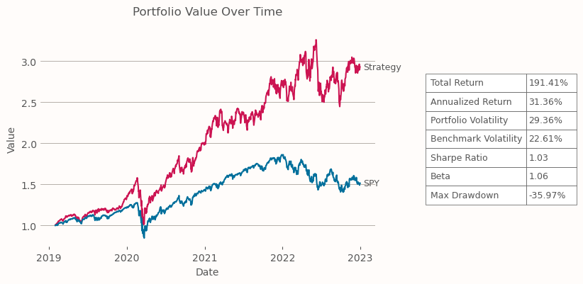<br>
      <em>Momentum</em>
    </td>
    <td align="center">
      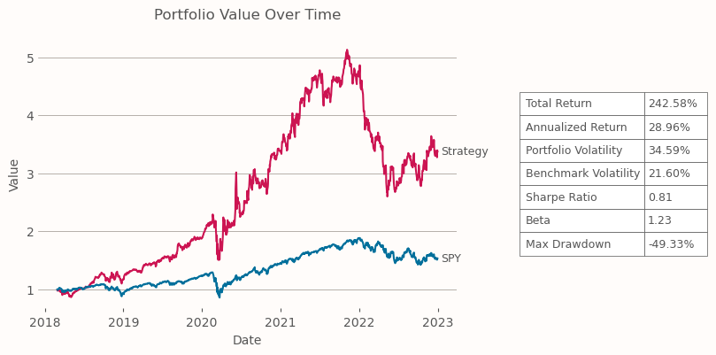<br>
      <em>Short-term Reversal</em>
    </td>
  </tr>
  <tr>
    <td align="center">
      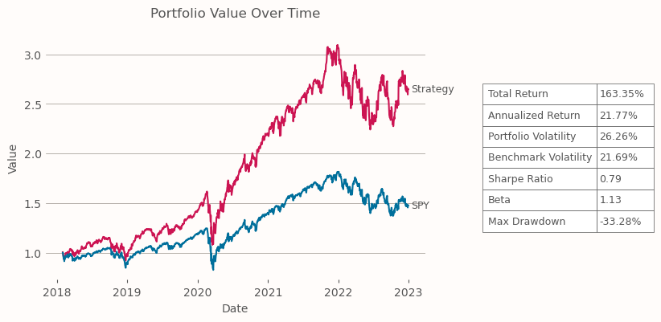<br>
      <em>Short Interest</em>
    </td>
    <td align="center">
      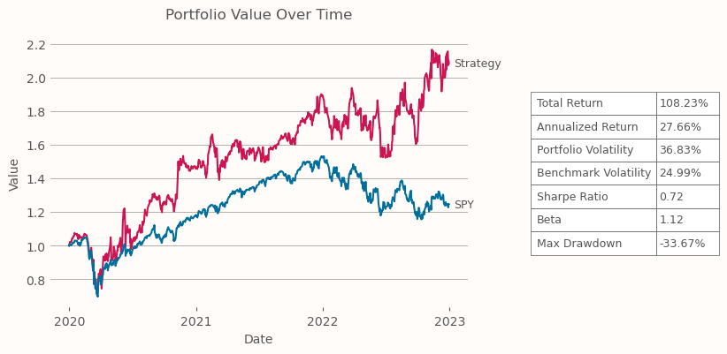<br>
      <em>ARIMA-GARCH</em>
    </td>
  </tr>
</table>

<p align="center">
  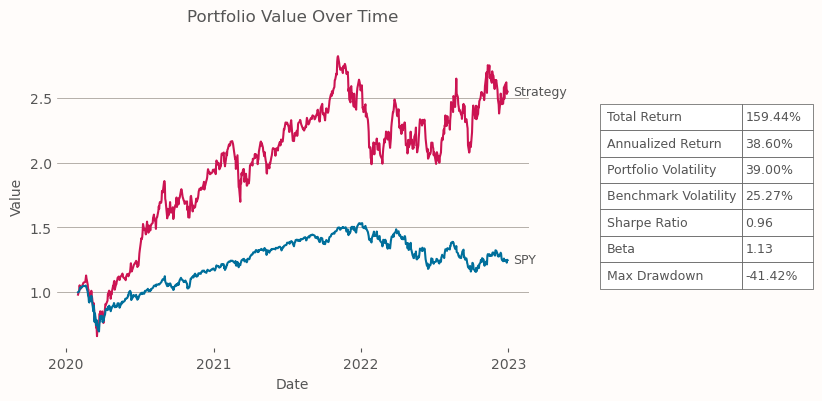<br>
  <em>Black-Litterman model</em>
</p>

## Out-sample Results

<table>
  <tr>
    <td align="center">
      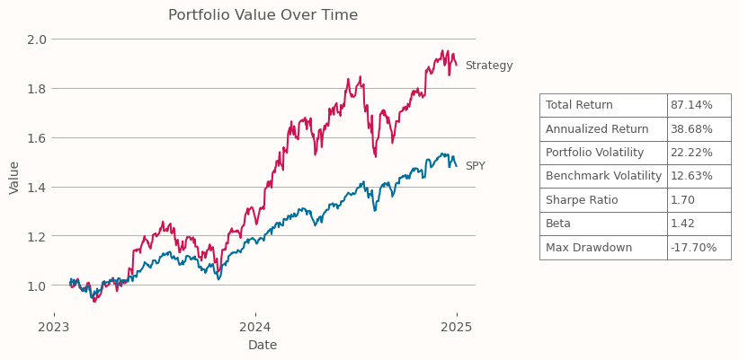<br>
      <em>Momentum</em>
    </td>
    <td align="center">
      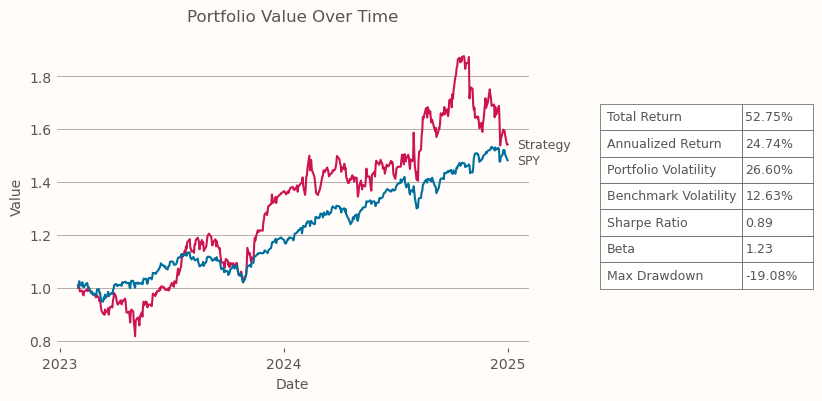<br>
      <em>Short-term Reversal</em>
    </td>
  </tr>
  <tr>
    <td align="center">
      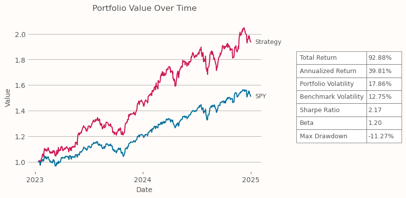<br>
      <em>Short Interest</em>
    </td>
    <td align="center">
      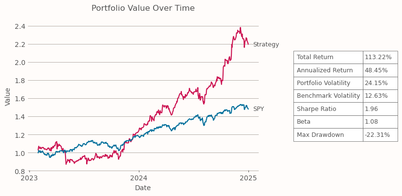<br>
      <em>ARIMA-GARCH</em>
    </td>
  </tr>
</table>

<p align="center">
  <br>
  <em>Black-Litterman model</em>
</p>